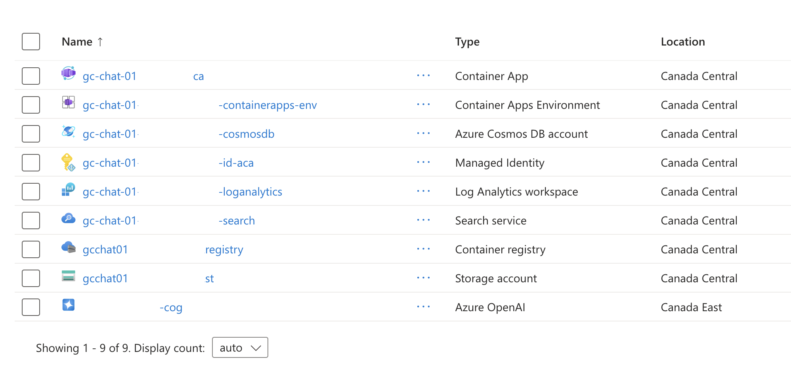

<div align="center">
  <h1>GC Chat 🇨🇦</h1>
  <p><em>by Paul Craig</em></p>
</div>

GC Chat is an open-source chatbot interface for the Government of Canada (GoC). GC Chat is accessible, bilingual, GoC-branded, and mobile-ready.

GC Chat is an [ASP.NET app](https://dotnet.microsoft.com/en-us/apps/aspnet) that can easily be deployed inside of Azure. At minimum, GC Chat requires a connection to an Azure OpenAI model, such as gpt-4o. You can use the [Azure AI Foundry](https://azure.microsoft.com/en-us/products/ai-foundry) to deploy a model for GC Chat to talk to.

The project includes all the infrastructure and configuration needed to provision Azure OpenAI resources and deploy the app to [Azure Container Apps](https://learn.microsoft.com/azure/container-apps/overview) using the [Azure Developer CLI](https://learn.microsoft.com/azure/developer/azure-developer-cli/overview).

Note that this repo was originally forked from [`ai-chat-quickstart-csharp`](https://github.com/Azure-Samples/ai-chat-quickstart-csharp)

## Demo gif

[](./docs/gc-chat-demo-lg.gif)

<details>
<summary>
This 50-second gif shows a basic walkthrough of GC Chat.
</summary>

<div>
It shows:

<ul>
<li>Asking a question</li>
<li>Opening a source</li>
<li>Asking another question</li>
<li>Leaving positive feedback</li>
<li>Clearing the conversation</li>
<li>Opening the Chat History</li>
<li>Looking at a past conversation</li>
<li>Browsing list of source documents</li>
<li>Resetting the chat</li>
</ul>
</div>
</details>

## Table of Contents

- [Features](#features)
- [Architecture diagram](#architecture-diagram)
- [Getting started](#getting-started)
  - [Local development](#local-development)
  - [Deploying GC Chat on Azure](#deploying-gc-chat-on-azure)
  - [Updating GCWeb](#updating-gcweb)
- [Resources](#resources)

## Features

- An [ASP.NET Core](https://dotnet.microsoft.com/en-us/apps/aspnet) that uses [Semantic Kernel](https://learn.microsoft.com/en-us/semantic-kernel/overview/) package to access language models to generate responses to user messages.
- A basic HTML/JS frontend that streams responses from the backend using JSON over a [ReadableStream](https://developer.mozilla.org/en-US/docs/Web/API/ReadableStream).
- A Blazor frontend that streams responses from the backend.
- [Bicep files](https://docs.microsoft.com/azure/azure-resource-manager/bicep/) for provisioning Azure resources, including Azure OpenAI, Azure Container Apps, Azure Container Registry, Azure Log Analytics, and RBAC roles.
- Using the OpenAI gpt-4o-mini model through Azure OpenAI.
- Support for using [local LLMs](/docs/local_ollama.md) or GitHub Models during development.

## Architecture diagram


## Getting started

You have a few options for getting started with this app.

We will focus on two:

1. Local development
2. Deployment on Azure

### Local development

GC Chat is an ASP.NET Core app you can run locally as long as you have an Azure OpenAI model to connect to.

If you have other resources deployed (eg, Azure AI Search, CosmosDB, a blobl storage container), you can also connect to those. However, the minimal requirement is an Azure OpenAI model.

#### 0. Prerequisites

To run the app locally, make sure the following tools are installed:

- [.NET 9](https://dotnet.microsoft.com/downloads/)
- [Git](https://git-scm.com/downloads)
- [Azure Developer CLI (azd)](https://aka.ms/install-azd)
- [VS Code](https://code.visualstudio.com/Download) or [Visual Studio](https://visualstudio.microsoft.com/downloads/)
  - If using VS Code, install the [C# Dev Kit](https://marketplace.visualstudio.com/items?itemName=ms-dotnettools.csdevkit)

#### 1. **Clone and open the app**

```bash
git clone git@github.com:pcraig3/gc-chat.git
cd <repo-root>/src/AIChatApp
```

#### 2. **Create appsettings.Local.json** (this file is ignored by git)

Copy `appsettings.Local.json.example` and create a new file: `appsettings.Local.json`.

```bash
# make sure you are in src/AIChatApp/
cp appsettings.Local.json.example appsettings.Local.json
```

#### 3. **Fill in Azure OpenAI configuration values**

- `AZURE_OPENAI_DEPLOYMENT`: the default is `gpt-4o`. Change this if you are using a different model.
- `AZURE_OPENAI_ENDPOINT`: The endpoint of your Azure OpenAI service. You can find this under `Azure OpenAI` > `Overview` > `Endpoints` in the Azure console.
- `AZURE_OPENAI_KEY`: (optional) The API key for your Azure OpenAI service.

Authentication can be done either using an API key or by using the `azd` command line tool.

_Option A — Key-based authentication_

Set `AZURE_OPENAI_KEY` using the value from `Azure OpenAI` → `Resource Management` → `Keys and Endpoint` → `KEY 1`.

_Option B — Credential-based authentication_

Sign in with Azure so the app uses [DefaultAzureCredential](https://learn.microsoft.com/dotnet/api/azure.identity.defaultazurecredential) (Azure AD / Microsoft Entra ID authentication):

```bash
azd auth login
```

Leave `AZURE_OPENAI_KEY` empty, you don't need it.

#### 4. **Run it**

```bash
dotnet run

# run with hot reloads
dotnet watch run
```

The app starts on `http://localhost:5153` and is fully usable against your Azure OpenAI deployment.

💡 Note: this repo was originally forked from [`ai-chat-quickstart-csharp`](https://github.com/Azure-Samples/ai-chat-quickstart-csharp), and can be run using local Ollama models if preferred. Read more here: [https://github.com/Azure-Samples/ai-chat-quickstart-csharp?tab=readme-ov-file#development-server](https://github.com/Azure-Samples/ai-chat-quickstart-csharp?tab=readme-ov-file#development-server)

### Deploying GC Chat on Azure

This project uses the [Azure Developer CLI (azd)](https://learn.microsoft.com/azure/developer/azure-developer-cli/overview) to provision Azure resources and deploy the app.

#### 0. Prerequisites and permissions

Before you begin:

- Make sure you have an Azure account and the [Azure Developer CLI](https://aka.ms/install-azd) installed.
- You must have sufficient permissions to create resources:
  - `Microsoft.Authorization/roleAssignments/write` (e.g. **Owner**, **User Access Administrator**, or **RBAC Administrator**)
  - `Microsoft.Resources/deployments/write` at the subscription or resource group level
- If you do not have these permissions, the steps below will fail. Ask an administrator to grant you access first (or have them create these resources so that you can connect to them).

#### 1. Authenticate with Azure

Log in to Azure with `azd`:

```
azd auth login
```

This will open a browser window and prompt you to sign in with your Azure account. Once logged in, your session will be cached for future `azd` commands.

#### 2. Create a new environment

An `azd` environment corresponds to an Azure resource group. The name you choose here will become the prefix for all provisioned resources.

```
azd env new gc-chat-01 --location canadacentral
azd env select gc-chat-01
```

#### 3. Provision Azure resources

Run:

```
azd provision
```

This step will create and configure all required Azure resources:

- **Azure OpenAI Service** — GPT-4o (chat) + text-embedding-3-large (vector embeddings)
- **Azure Container Apps** — .NET hosting
- **Azure Container Registry** — container images
- **Azure AI Search** — vector search + document indexing
- **Azure Cosmos DB** — chat session + user data storage
- **Azure Blob Storage** — document repository
- **Log Analytics Workspace** — monitoring and logging

Provisioning can take a few minutes. You will see progress in the terminal, and you can also view detailed progress in the Azure Portal.

By defualt, all resources will be deployed in `Canada Central`, except for Azure OpenAI, which is deployed in `Canada East`.

Here is what you should see once everything is deployed:



#### 4. Collect configuration values

Once provisioned, gather connection values from the Azure Portal and add them to a local settings file.

Add these values to your `/src/AIChatApp/appsettings.Local.json`. (Note that this file is ignored by git):

```json
{
  "DetailedErrors": true,
  "AIHost": "azureOpenAI",
  "ASPNETCORE_ENVIRONMENT": "Development",

  "AZURE_OPENAI_DEPLOYMENT": "gpt-4o",
  "AZURE_OPENAI_ENDPOINT": "https://<your-openai>.openai.azure.com/",
  "AZURE_OPENAI_KEY": "<your-openai-key>",

  "cosmosdb-connection-string": "<your-cosmosdb-connection-string>",
  "storage-connection-string": "<your-storage-connection-string>",

  "search-api-key": "<your-search-admin-key>",
  "search-endpoint": "https://<your-search-service>.search.windows.net",
  "search-index-name": "<your-index-name>"
}
```

Where to find these values:

- **Cosmos DB connection string:** `Cosmos DB` → `Settings` → `Keys` → `PRIMARY CONNECTION STRING`
- **Storage connection string:** `Storage Account` → `Security + networking` → `Access keys` → `Connection string (key1)`
- **Search API key:** `Search Service` → `Settings` → `Keys` → `Primary admin key` or `Secondary admin key`
- **Search endpoint:** `Search Service` → `Overview` → copy the endpoint `URL`
- **Search index name**: `Search Service` → `Search Management` → `Indexes` → copy your index name

#### 5. Deploy the application

Once your configuration file is filled in, you can run the application locally, or deploy the application code.

To deploy the application, use `azd`.

```shell
azd deploy
```

This step will:

- Build and push the .NET container image to Azure Container Registry
- Deploy the container to Azure Container Apps
- Inject your configuration values into the container environment

When finished, the command output will include the public Container App URL. Open it in your browser to use the app.

In future, when you've made any changes to the app code, you can just run `azd deploy` again and your new changes will be deployed.

### Updating GCWeb

GC Chat uses [GCWeb](https://wet-boew.github.io/GCWeb/index-en.html) assets to match the Canada.ca design.

To update GCWeb assets, grab the latest release of GCWeb, unzip the latest build, and then move the various assests into the appropriate `src/AIChatApp/wwwroot/GCWeb` folders.

Instructions for updating GCWeb:

1. Find the latest GCWeb release on GitHub: https://github.com/wet-boew/GCWeb/releases (eg, here is the release tag for 17.5.0: https://github.com/wet-boew/GCWeb/releases/tag/v17.5.0)
2. Scroll down to "Assets", download the `themes-dist*.zip` file
3. Unzip it
4. Open `/GCWeb` directory and copy everything inside into this folder: `src/AIChatApp/wwwroot/GCWeb`
5. Boot up the app and check for visual changes
6. If you see any noticeable differences that you want to revert, add custom CSS to `src/AIChatApp/wwwroot/css/app.css`

## Resources

- [Chat Application using Azure OpenAI (C#/.NET)](https://github.com/Azure-Samples/ai-chat-quickstart-csharp): A simple C#/.NET chat application that uses managed identity for Azure OpenAI access. Designed for deployment on Azure Container Apps with the Azure Developer CLI.
- [RAG chat with Azure AI Search + C#/.NET](https://github.com/Azure-Samples/azure-search-openai-demo-csharp/): A more advanced chat app that uses Azure AI Search to ground responses in domain knowledge. Includes user authentication with Microsoft Entra as well as data access controls.
- [Develop .NET Apps with AI Features](https://learn.microsoft.com/en-us/dotnet/ai/get-started/dotnet-ai-overview)
